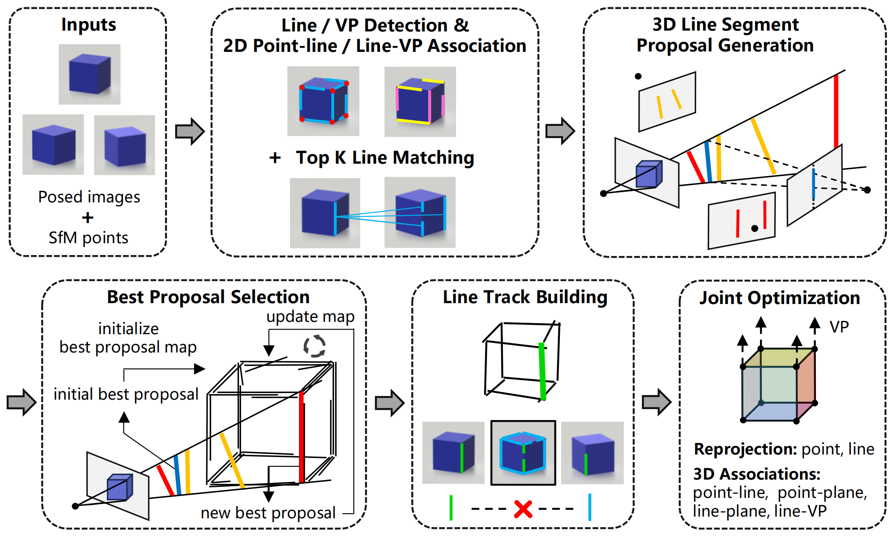

# Consistent 3D Line Mapping (CLMAP)

Official implementation of paper "Consistent 3D Line Mapping" at ECCV 2024.

The code and a detailed README file will be available shortly.

## Method

**Pipeline overview**. Given posed images and SfM points, we first perform feature detection, matching, and association. Then, we sequentially run the process of 3D line segment proposal generation (only demonstrating the Line+Line method here), best proposal selection, line track building, and end with joint optimization.

