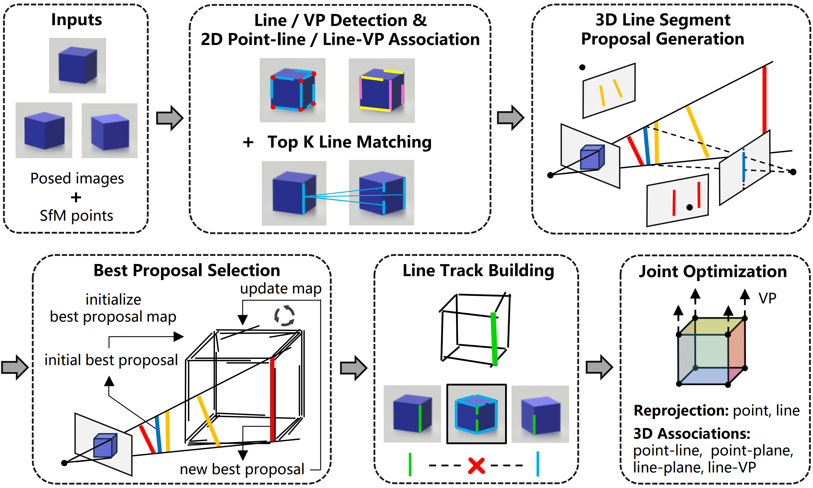

# Consistent 3D Line Mapping (CLMAP)
[[paper](https://www.ecva.net/papers/eccv_2024/papers_ECCV/papers/07710.pdf)] [[supplementary material](https://www.ecva.net/papers/eccv_2024/papers_ECCV/papers/07710-supp.pdf)]

Official implementation of paper "Consistent 3D Line Mapping" at ECCV 2024.

## Method
<p align="center">

</p>

**Pipeline overview**. Given posed images and SfM points, we first perform feature detection, matching, and association. Then, we sequentially run the process of 3D line segment proposal generation (only demonstrating the Line+Line method here), best proposal selection, line track building, and end with joint optimization.

## Installation
- This repository requires Python 3.9+ and CMake >= 3.17. 
- We test this repository on **Ubuntu 20.04** and **Ubuntu 22.04**.
- This repository does not currently support Windows systems.

The following script is an example of a conda environment setup.

```bash
# 1. Install COLMAP 3.8
#  * Guide: https://colmap.github.io/install.html. (make sure to use the tag 3.8)

# 2. Install PoseLib.
#  * Guide: misc/install/poselib.md

# 3. Install HDF5.
sudo apt-get install libhdf5-dev

# 4. Create a conda environment.
conda create -n clmap python==3.9
conda activate clmap

# 5. Install PyTorch (torch>=1.12). Please refer to https://pytorch.org/get-started/previous-versions/ to select the appropriate version.
pip install torch==1.12.0+cu116 torchvision==0.13.0+cu116 torchaudio==0.12.0 --extra-index-url https://download.pytorch.org/whl/cu116

# 6. Install CLMAP.
git clone --recursive https://github.com/3dv-casia/clmap.git
cd clmap
pip install -r requirements.txt
pip install -Ive .
python -c "import limap"  # check if the package is successfully installed
```

## Quickstart

### 1. Download dataset
Download the test scene *ai\_001\_001* in [Hypersim](https://github.com/apple/ml-hypersim) dataset with the following command.
```bash
bash scripts_clmap/quickstart.sh
```

### 2. Line mapping
To run line mapping (RGB-only) on scene *ai\_001\_001*:
```bash
# 1. Run line triangulation: line detection & matching, proposal generation, best proposal selection, and line track building.
tri_output_dir=outputs/quickstart_triangulation
python runners_clmap/hypersim/triangulation.py --output_dir ${tri_output_dir}
# evaluate and print the consistency percentage with "--triangulation.debug_mode True"

# 2. Run joint optimization with 3D points, 3D lines, 3D planes, and vanishing points (VPs).
plp_output_dir=outputs/quickstart_plp_association
python runners_clmap/plp_association.py --input_folder ${tri_output_dir}/finaltracks --colmap_model_path ${tri_output_dir}/colmap_outputs/sparse --visualize True --load_dir ${tri_output_dir} --load_vpdet True --output_dir ${plp_output_dir}
# if `visualize` is set to True, you need to close the visualization window in order to continue running the program
```

### 3. Visualization
To run visualization of the 3D line map after the reconstruction:
```bash
python visualize_3d_lines.py --input_dir ${plp_output_dir}/finaltracks -nv 4
# add the camera frustums with "--imagecols ${plp_output_dir}/finaltracks/imagecols.npy"
```

### 4. Evaluation

To run evaluation of the 3D line map:
```bash
python scripts_clmap/eval_hypersim.py --input_dir ${plp_output_dir}/finaltracks
# specify the number of visible views with "-nv ${nv}" (4 visible views by default)
```

## Run 3D line mapping from COLMAP

```bash
output_dir=<output path>
colmap_path=<colmap path>
model_path=sparse
image_path=images
bash experiments/line_mapping_from_colmap.sh ${colmap_path} ${model_path} ${image_path} ${output_dir}
```
- Please refer to `experiments/line_mapping_from_colmap.sh` for detail settings.
- The above program includes both **line triangulation** (to produce the initial map) and **joint optimization** (to take the initial map as the input and produce the final map).
- The initial line map without filtering based on visible views is saved in `${output_dir}/tri/finaltracks`, while the initial line map with each 3D line segment containing at least 4 visible views is saved in `${output_dir}/tri/alltracks_nv4.txt`.
- The final line map without filtering based on visible views is saved in `${output_dir}/plp/finaltracks`, while the final line map with each 3D line segment containing at least 4 visible views is saved in `${output_dir}/plp/alltracks_nv4.txt`.

## Evaluation on Hypersim dataset
[Hypersim](https://github.com/apple/ml-hypersim) is a photorealistic synthetic dataset for holistic indoor scene understanding.

### 1. Prepare Hypersim dataset

Download the first eight scenes (100 images per scene) of the [Hypersim](https://github.com/apple/ml-hypersim) dataset with the following script.

```bash
hypersim_data_dir=<path_to_dataset>/hypersim  # Hypersim dataset directory (requires at least 33GB free space)
bash experiments/hypersim/download.sh ${hypersim_data_dir}
```

### 2. Run 3D line mapping on Hypersim dataset

```bash
hypersim_output_dir=<path_to_output>/hypersim/line_mapping
bash experiments/run_hypersim.sh ${hypersim_data_dir} ${hypersim_output_dir}
```
- We test [LSD](https://github.com/iago-suarez/pytlsd) lines and [DeepLSD](https://github.com/cvg/DeepLSD) lines, equipped with the [GlueStick](https://github.com/cvg/GlueStick) line matcher (Top 10 matching). 

- Evaluation results for initial line maps (i.e., without joint optimization) are reported in `${hypersim_output_dir}/lsd/tri/eval_log_nv_4.txt` and `${hypersim_output_dir}/deeplsd/tri/eval_log_nv_4.txt`.
- Evaluation results for final line maps (i.e., with joint optimization) are reported in `${hypersim_output_dir}/lsd/plp/eval_log_nv_4.txt` and `${hypersim_output_dir}/deeplsd/plp/eval_log_nv_4.txt`.

## Evaluation on *Tanks and Temples* dataset

[*Tanks and Temples*](https://www.tanksandtemples.org/) is a benchmark dataset for image-based 3D reconstruction.

### 1. Prepare *Tanks and Temples* dataset

Download the `image set` of the `Training Data` of the [*Tanks and Temples*](https://www.tanksandtemples.org/) dataset from the [official link](https://www.tanksandtemples.org/download/), and save the data like the following form:

```bash
tnt_data_dir=<path_to_dataset>/tnt  # Tanks and Temples dataset directory (requires at least 26GB free space)

${tnt_data_dir}/training
├── Barn
    ├── 000001.jpg
    ├── 000002.jpg
    ├── 000003.jpg
    ...
├── Caterpillar
├── Church
├── Courthouse
├── Ignatius
├── Meetingroom
└── Truck
```

Download the `meta_train` data from the [official link](https://drive.google.com/file/d/1jAr3IDvhVmmYeDWi0D_JfgiHcl70rzVE/view?usp=sharing&resourcekey=), unzip it, and rename the unzipped `trainingdata` folder as the `meta_train` and save the data like the following form:

```bash
${tnt_data_dir}/meta_train
├── Barn
    ├── Barn_COLMAP.ply
    ├── Barn_COLMAP_SfM.log
    ├── Barn.json
    ├── Barn_mapping_reference.txt
    ├── Barn.ply
    ├── Barn_trans.txt
├── Caterpillar
├── Church
├── Courthouse
├── Ignatius
├── Meetingroom
└── Truck
```

Run COLMAP and align the COLMAP model on the [*Tanks and Temples*](https://www.tanksandtemples.org/) dataset with the following script.

```bash
# 1. Run COLMAP on the `Training Data` without considering the scene `Ignatius`.
tnt_colmap_dir=${tnt_data_dir}/colmap
bash experiments/tnt/run_colmap.sh ${tnt_data_dir}/training ${tnt_colmap_dir}

# 2. Align COLMAP models with the Ground Truth point clouds.
bash experiments/tnt/align_colmap.sh ${tnt_data_dir}/meta_train ${tnt_colmap_dir}
```

- We follow [LIMAP](https://github.com/cvg/limap.git)’s suggestion to remove the scene `Ignatius` because it has almost no line structures.
- In the end, the aligned COLMAP model for the scene `${scene_id}` will be saved in `${tnt_colmap_dir}/${scene_id}/dense/aligned`.

### 2. Run 3D line mapping on *Tanks and Temples* dataset

```bash
tnt_output_dir=<path_to_output>/tnt/line_mapping
bash experiments/run_tnt.sh ${tnt_output_dir} ${tnt_data_dir}/meta_train ${tnt_colmap_dir} False
```
- We test [LSD](https://github.com/iago-suarez/pytlsd) lines and [DeepLSD](https://github.com/cvg/DeepLSD) lines, equipped with the [GlueStick](https://github.com/cvg/GlueStick) line matcher (Top 10 matching). 

- Evaluation results for initial line maps (i.e., without joint optimization) are reported in `${tnt_output_dir}/lsd/tri/eval_log_nv_4.txt` and `${tnt_output_dir}/deeplsd/tri/eval_log_nv_4.txt`.
- Evaluation results for final line maps (i.e., with joint optimization) are reported in `${tnt_output_dir}/lsd/plp/eval_log_nv_4.txt` and `${tnt_output_dir}/deeplsd/plp/eval_log_nv_4.txt`.

## Possible issues
### 'GLIBCXX_3.4.30' not found
Solution:
```bash
ln -sf /usr/lib/x86_64-linux-gnu/libstdc++.so.6  {path to anaconda}/envs/clmap/bin/../lib/libstdc++.so.6
```
- Refer to this [issue](https://github.com/cvg/limap/issues/2) in [LIMAP](https://github.com/cvg/limap.git) for details.

## Citation
If you find our work useful, please consider citing:

```bibtex
@InProceedings{Bai_2024_CLMAP,
    author = {Bai, Xulong and Cui, Hainan and Shen, Shuhan},
    title = {Consistent 3D Line Mapping},
    booktitle = {European Conference on Computer Vision (ECCV)},
    year = {2024},
}
```

Our project is mainly built on [LIMAP](https://github.com/cvg/limap.git), so if you use our project, please also consider citing [LIMAP](https://github.com/cvg/limap.git)'s paper:

```bibtex
@InProceedings{Liu_2023_LIMAP,
    author = {Liu, Shaohui and Yu, Yifan and Pautrat, Rémi and Pollefeys, Marc and Larsson, Viktor},
    title = {3D Line Mapping Revisited},
    booktitle = {Computer Vision and Pattern Recognition (CVPR)},
    year = {2023},
}
```

## Acknowledgments
We thank the following excellent projects:

- [LIMAP](https://github.com/cvg/limap.git)
- [Line3D++](https://github.com/manhofer/Line3Dpp.git)
- [PlaneDetection](https://github.com/abner-math/PlaneDetection.git)
- [COLMAP](https://github.com/colmap/colmap.git)